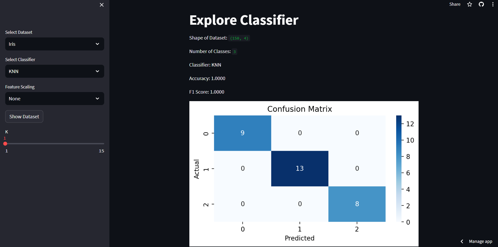

# Explore Classifier with Streamlit

This project is a web application that allows users to experiment with different machine learning models on various datasets with different parameters. It is developed using Streamlit and Python.

You can explore the application here: https://explore-classifiers.streamlit.app/


## Usage

To run the project locally, follow these steps:


```bash
  git clone https://github.com/Mehmet-Unluturk/Explore_Classifiers.git
```

Go to the project directory:

```bash
  cd explore-classifier
```

Install the required libraries:

```bash
  pip install -r requirements.txt
```

Run the following command to start the web application:

```bash
  streamlit run explore_classifier.py
```

  
## Features

- **Dataset Selection:** Choose from supported datasets - Iris, Wine, Breast Cancer.
- **Classifier Selection:** Pick a classifier from the available options - K-Nearest Neighbors (KNN), Support Vector Machine (SVM), Random Forest, Naive Bayes, Logistic Regression, Decision Tree.
- **Parameter Adjustment:** Customize classifier parameters using interactive sliders and checkboxes.
- **Feature Scaling:** Optionally scale features using StandardScaler or MinMaxScaler.
- **Results Display:** View accuracy, F1 score, confusion matrix, and a PCA plot of the first two components.

## Supported Datasets
- Iris
- Wine
- Breast Cancer

# Supported Classifiers
- K-Nearest Neighbors (KNN)
- Support Vector Machine (SVM)
- Random Forest
- Naive Bayes
- Logistic Regression
- Decision Tree
  
## Screenshots



  
## License

[](https://opensource.org/licenses/MIT)

  